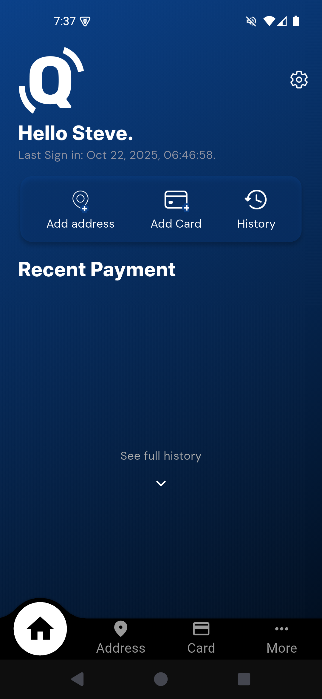
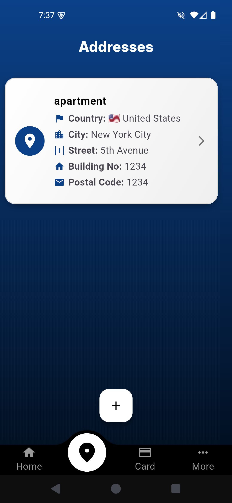
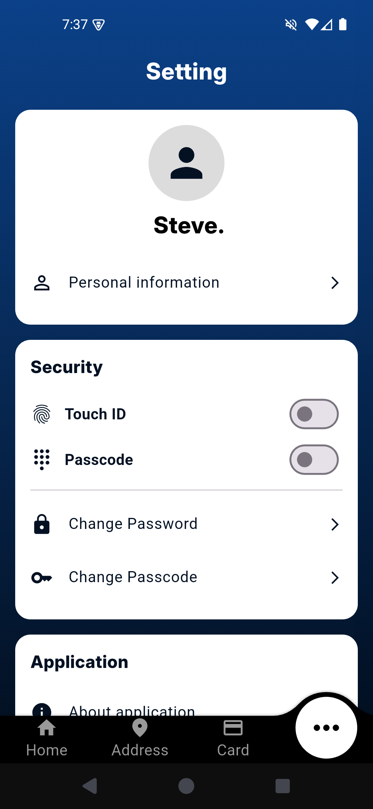
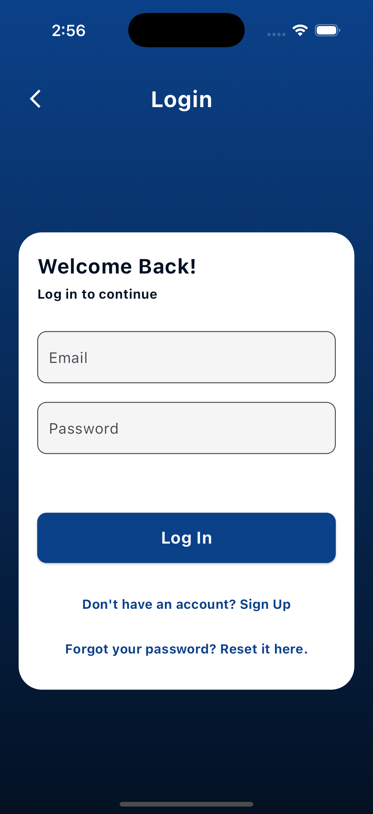
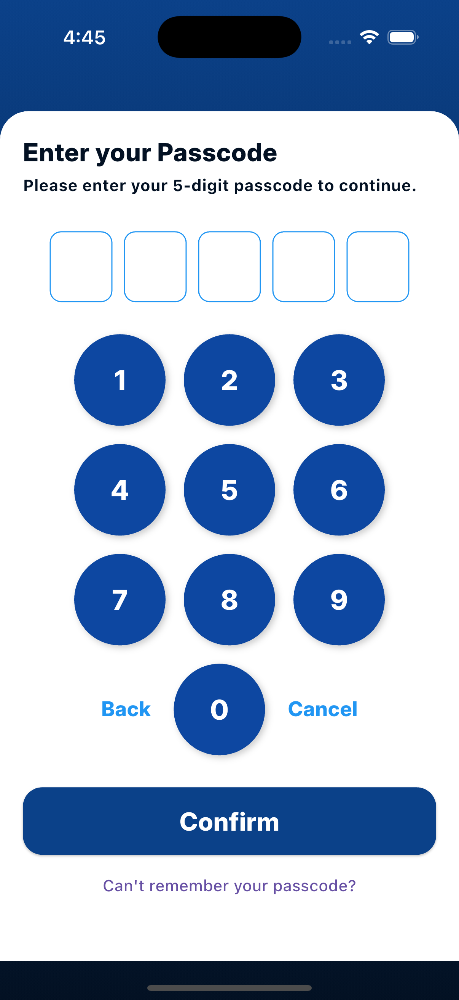

# onQuick

## Project Summary 📜

This project is a **mobile app** developed using **Flutter**, integrated with **Google Firebase** for backend services and **Stripe** as the payment gateway.  
It addresses the problem of **cart abandonment in e-commerce** by providing:

- A **fast checkout solution** to reduce friction during purchase.  
- A **Shopping Info Vault** to securely store payment information, ensuring quick and seamless transactions for users.  

## Project Overview 📄
 
Cart abandonment is a significant issue in e-commerce businesses, 
with studies showing that nearly 70% of shopping carts are 
abandoned before checkout. This not only results in significant lost 
revenue but also highlights inefficiencies in the online shopping 
process. To address the issue of cart abandonment, we propose 
developing a system that includes a fast checkout solution and a 
Shopping Info Vault to store all payment information.

## Functional Requirements  (Sample) 📝

| Feature                 | Description                                                                                  | Priority      |
|-------------------------|----------------------------------------------------------------------------------------------|---------------|
| Authentication          | Users should be able to login using biometric authentication methods such as Face ID or Touch ID. The system should capture and verify biometric data using the device's sensors. | 🥈 Medium     |
| Cards Management        | The system should validate the information of the creedit card securely store it within the user’s device. This ensures quick access while maintaining user privacy and security. | 🥇 High       |
| Addresses Management    | The user should be able to add an address. The system should prompt the user to provide multiple details, such as country, city, street, building number, and postal code. | ⏳ Planned    |
| Transaction Processing  | The system should identify and record the shop where the user makes their purchases, associated with the amount of the transaction and current date and time. This information should be captured during the transaction process. | ✅ Complete   |
| Software Settings       | The user should be able to enable or disable biometric authentication (such as Face ID or fingerprint) from the app settings. The selected state (enabled or disabled) should be saved securely on the user’s device and applied the next time the app is opened. | ✅ Complete   |

## Screenshots 📱

  
  
  
  

  
  
  

